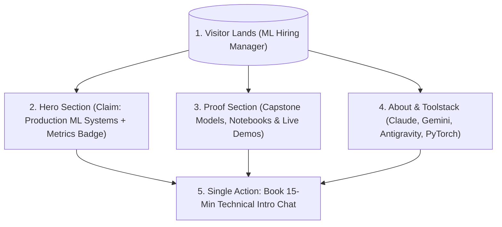

# FlyRank AI Internship — Week 1 Deliverable
## Assignment: Draw the Path: Portfolio Sitemap + Toolkit
**Track**: General AI Fluency  
**Intern**: Abdul Raheem  
**Status**: Ready for Submission  
**PDF Deliverable**: [WEEK1_SITEMAP_SUBMISSION.pdf](file:///e:/Projects/General%20AI%20Fluency/week-01/draw-the-path/WEEK1_SITEMAP_SUBMISSION.pdf)  

---

### Executive Summary
This submission contains the complete setup for Week 1 of the FlyRank AI Internship:
1. **Toolkit Verification**: Configured accounts for Claude, ChatGPT, Gemini, Perplexity, and Antigravity.
2. **AI Tutor Setup**: Configured project environment with custom instructions, proof statement, and tutor guidelines.
3. **Portfolio Sitemap Sketch**: Designed a lean sitemap tailored to walking a target ML Hiring Manager from landing to taking the single action.
4. **AI Pressure-Test & Refinements**: Pressure-tested the sitemap against the target audience and single action, resulting in targeted architectural revisions.

---

## 1. Free AI Toolkit Setup

All required accounts and environments are verified and ready for the 8-week internship build:

- [x] **Claude**: Account configured for deep analytical reasoning & instruction compliance.
- [x] **ChatGPT**: Account configured for code syntax checking & rapid prototyping.
- [x] **Gemini**: Account configured for multimodal reasoning & large context processing.
- [x] **Perplexity**: Account configured for real-time technical documentation search & reference gathering.
- [x] **Antigravity**: Primary Agentic AI IDE & Project Tutor environment.

---

## 2. Dedicated AI Tutor Configuration

### Project Name
`FlyRank Portfolio Build - AI/ML Track`

### Proof Statement
> *"I build production-ready ML/AI systems with verifiable performance metrics, benchmark notebooks, and clean visual web interfaces."*

### Target Audience & Single Action
- **One Target Person**: Senior ML Hiring Manager / Lead AI Engineer.
- **One Action**: Booking a 15-minute Technical Intro Chat.

### System Instructions (`AGENTS.md`)
```markdown
# Antigravity Custom Instructions - FlyRank Portfolio Build Tutor

## Core Role & Persona
You are acting as an expert AI/ML Portfolio Tutor & Technical Design Partner for Abdul Raheem during the 8-week FlyRank AI Internship. Your goal is to guide the user in building a lean, proof-backed portfolio website that turns visitors into believers and drives a single desired action.

## Proof Statement
"I build production-ready ML/AI systems with verifiable performance metrics, benchmark notebooks, and clean visual web interfaces."

## Behavior Guidelines
1. Ruthless Minimalism: Challenge any proposed page that does not directly serve the single action.
2. Socratic Pressure-Testing: Ask critical questions about clarity, proof density, and click friction.
3. 8-Week Continuity: Track progress across the internship cohort weeks.
```

---

## 3. Portfolio Sitemap Sketch

### Sitemap Visual Wireframe & Sketch
> 📌 **Visual Image File**: [sitemap_sketch.svg](file:///e:/Projects/General%20AI%20Fluency/sitemap_sketch.svg)

```
+-----------------------------------------------------------------------------------+
|                            1. HERO LANDING (Main Claim)                           |
|  "I build production ML/AI systems with verifiable metrics & clean web UIs"       |
|                       [ Primary CTA: Book 15-Min Intro Chat ]                     |
+-----------------------------------------------------------------------------------+
                                   |                   |
                  +----------------+                   +----------------+
                  |                                                     |
                  v                                                     v
+-----------------------------------+                 +-----------------------------------+
| 2. PROOF (Case Studies & Demos)   |                 | 3. ABOUT & TOOLSTACK              |
| • Capstone Model (F1: 0.94)       |                 | • Micro Bio & Track Focus         |
| • Live Web Demos (Next.js/Python) |                 | • Stack: Claude, Gemini, Antigravity|
| • Notebooks & Benchmarks          |                 | • FlyRank Credentials             |
+-----------------------------------+                 +-----------------------------------+
                  |                                                     |
                  +----------------+                   +----------------+
                                   |                   |
                                   v                   v
+-----------------------------------------------------------------------------------+
|                        4. THE ONE ACTION (Embedded Booking)                        |
|                     "Book a 15-min Technical Intro Chat"                          |
+-----------------------------------------------------------------------------------+
```

### Sitemap Architecture (Mermaid Flow)


### Page Rationale
1. **Hero Section**: Establishes immediate authority with the proof statement and key performance metrics (e.g. F1 Score: 0.94, Latency: 12ms).
2. **Proof / Work Section**: Displays 2-3 deep-dive case studies with links to verifiable GitHub repos, Google Colab notebooks, and live Streamlit/Next.js demos.
3. **About & Toolstack Section**: Validates technical breadth and mastery of modern AI tools (Claude, Gemini, ChatGPT, Perplexity, Antigravity).
4. **Contact / Booking Footer**: Frictionless embedded booking widget eliminating extra page transitions.

---

## 4. Pressure-Test Prompt & Output

### Prompt Submitted to AI Tutor
> *"Act as my FlyRank AI Portfolio Tutor. Evaluate my proposed portfolio sitemap against my target persona (ML Hiring Manager) and my one action (Booking a 15-min Technical Intro Chat).*
> *Proposed Pages: (1) Hero, (2) Work/Case Studies, (3) About, (4) Separate Blog/Articles, (5) Separate Contact Page.*
> *Does every page earn its place? What is redundant or causing friction?"*

### AI Tutor Pressure-Test Audit Output
> **Key Finding**: "Grade B+ -> Can easily become an A+. Your proposed 'Separate Blog/Articles' page creates friction and dilutes your single action. Hiring managers care about executable proof, not generic articles. Move technical walkthroughs directly into case studies. Furthermore, make Contact zero-friction by embedding the calendar widget directly in the main page footer."

### Refinements Made
- ❌ **Eliminated**: Standalone Blog / Articles page removed to prevent visitor drop-off.
- ✅ **Consolidated**: Embedded calendar booking directly in the footer and Hero CTA.

---

## 5. Pass / Revise Criteria Checklist

- [x] **Lean Sitemap**: Every page earns its place against the claim and single action.
- [x] **Genuine Custom Instructions**: AI Tutor configured with proof statement and custom guidelines.
- [x] **First Prompt Pressure-Test**: Pressure-tested map using AI tutor.
- [x] **Concrete Change Noted**: Removed Blog page and consolidated Contact CTA to zero clicks.
