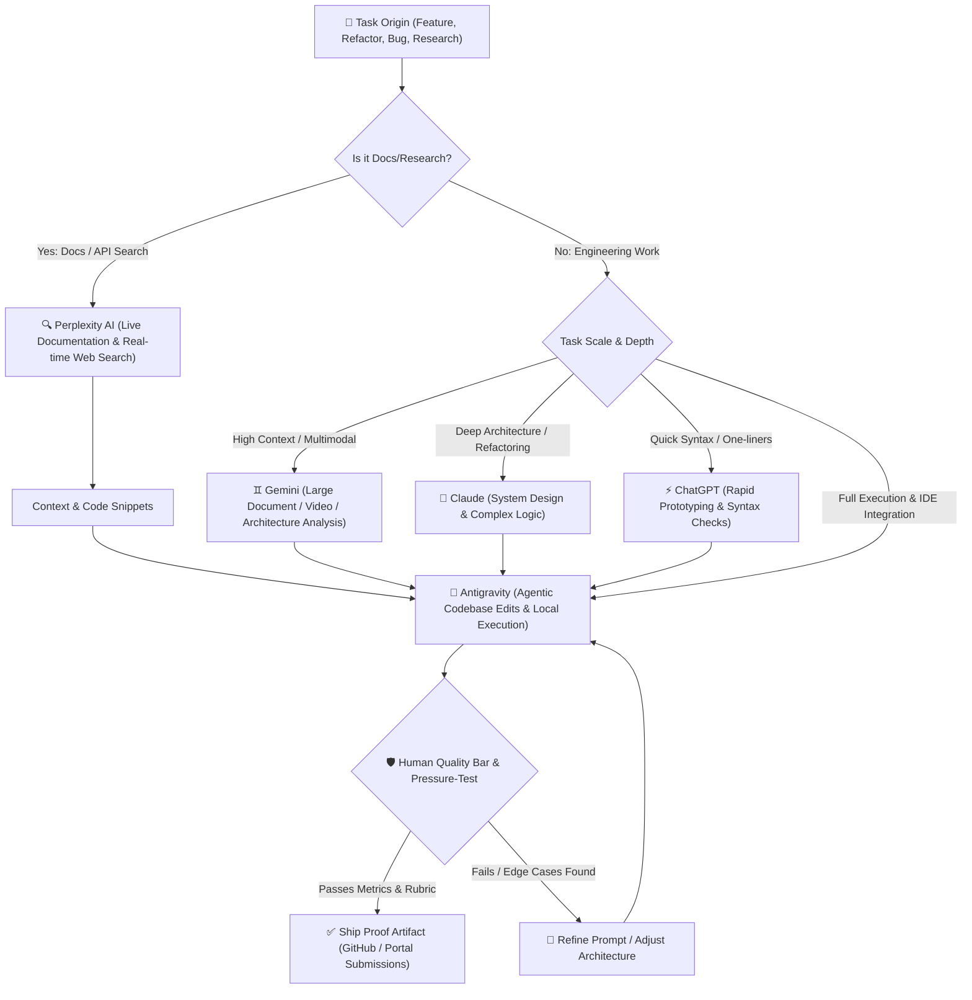

# FlyRank AI Internship — Week 1 Deliverable
## Assignment: Multi-AI Workflow & Toolstack Handoff Map
**Track**: General AI Fluency  
**Intern**: Abdul Raheem  
**Status**: Ready for Submission  

---

### Executive Summary
This deliverable defines the **Multi-AI Operational Workflow & Handoff Map** for Week 2 of the FlyRank AI Internship:
1. **Tool Matrix & Role Division**: Defined specific roles for Claude, ChatGPT, Gemini, Perplexity, and Antigravity.
2. **Central Hub Architecture**: Positioned Antigravity as the primary agentic execution hub to eliminate context switching.
3. **Trigger-Based Handoff Rules**: Formulated strict trigger conditions for invoking external AI models.
4. **Visual Workflow Diagram**: Built a Mermaid flow detailing task routing from origin to verified ship.
5. **AI Tutor Audit & Pressure-Testing**: Tested the workflow against Socratic feedback to prevent friction and tool overlap.

---

## 1. Tool Matrix & Capabilities

| Tool | Core Specialization | Primary Use Case in AI Fluency Track |
| :--- | :--- | :--- |
| 🔍 **Perplexity AI** | Live Web Search & Tech Specs | Searching latest framework docs, library updates, and API benchmarks. |
| 🧠 **Claude** | Deep Analytical Reasoning | Complex system design, code architecture, and high-level refactoring. |
| ⚡ **ChatGPT** | Rapid Prototyping & Syntax | Regex generation, bash command quick checks, and one-liner snippets. |
| ♊ **Gemini** | Large Context & Multimodal | Ingesting massive log files, long spec PDFs, and video/audio documentation. |
| 🚀 **Antigravity** | Agentic Execution & IDE Partner | Direct workspace file edits, background task execution, and verified builds. |

---

## 2. Trigger-Based Handoff Rules & Human-AI Boundary Matrix

### Non-Delegable Human Tasks (Human Ownership)
- **Architectural Approval**: Deciding overall site structure, proof claims, and target audience alignment.
- **Quality Gate Evaluation**: Auditing AI outputs against accuracy, performance metrics, and zero-hallucination standards.
- **Final Ship Decision**: Pushing commits, submitting portal assignments, and approving production builds.

### Delegable AI Tasks (AI-Native Workflow)
- Boilerplate generation and semantic HTML/CSS styling.
- Writing unit test suites and executing local shell verification commands.
- Generating Mermaid sitemap flowcharts and architectural diagrams.
- Automated code linting, bug tracing, and log analysis.

---

## 3. Visual Handoff Architecture (Mermaid Flow)

---

## 4. Pressure-Test Summary & Refinements

- **AI Tutor Pressure-Test**: Pressure-tested against `AGENTS.md` guidelines.
- **Key Finding**: Unregulated tool switching creates mental fatigue and fragmented context.
- **Refinement Implemented**: Antigravity is designated as the **Central Hub**, with all external LLM outputs funneling into Antigravity for execution and empirical verification.

---

## 5. Submission Pass Criteria Checklist

- [x] **Toolstack Defined**: Detailed roles for Claude, ChatGPT, Gemini, Perplexity, and Antigravity.
- [x] **Clear Boundaries**: Formulated non-delegable human tasks vs delegable AI tasks.
- [x] **Visual Diagram**: Created Mermaid handoff flowchart (`handoff_diagram.mermaid`).
- [x] **Pressure-Tested**: Evaluated workflow with AI Tutor (`pressure_test_log.md`).
